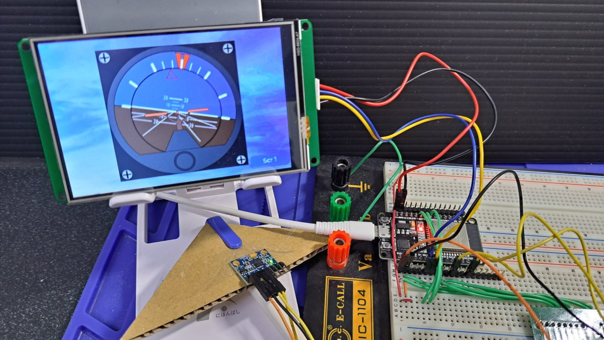
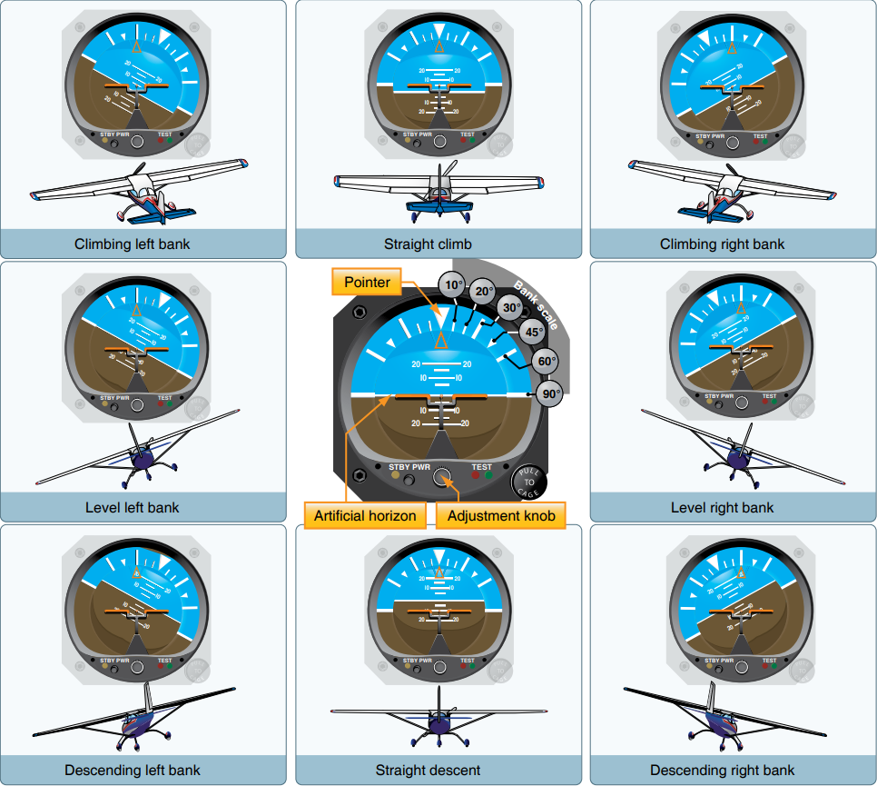
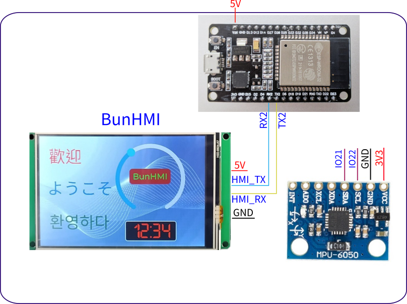
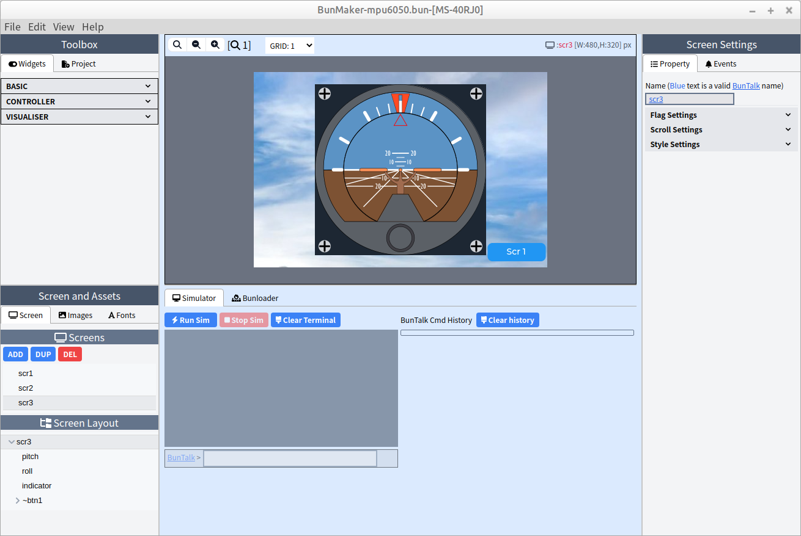

# BunHMI_esp32_mpu6050
The MPU-6050 is a module with a 3-axis accelerometer and a 3-axis gyroscope.

Feature list
* Using [BunHMI](https://www.mcuidea.com) to display MPU-6050 reading data
* Create a GUI to simulate the airplane Attitude Indicator.

## Attitude Indicator
The GUI animate is according to following chart

The svg file of Attitude Indicator can be found here: https://openclipart.org/detail/19163/attitude-indicator

## Schematic

## BunMaker Screenshoot

The "BunHMI" folder includes the BunMaker project. you can open project by BunMaker: https://shop.mcuidea.com/bunmaker

## ESP32 code
The "BunHMI_attitude_indicator" folder includes esp32 arduino source code.

